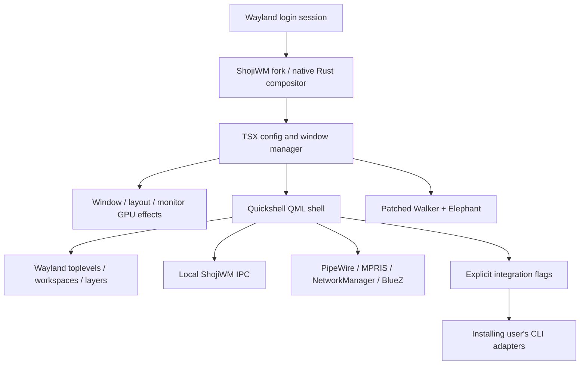

# Desktop architecture

## Compositor layer

`config/shojiwm/src/index.tsx` is the composition entrypoint. It configures outputs,
input, environment, processes and hotkeys; assigns window, layer and popup effects;
builds CSD/SSD window paths; and serves local IPC. `window-manager.ts` owns window
geometry, tiling/floating layout, focus, workspace state, fullscreen, minimization,
dragging and transitions. `window-animation.ts` provides animation helpers.

Runtime IPC is newline-delimited JSON over
`${XDG_RUNTIME_DIR}/shojiwm-${WAYLAND_DISPLAY}.sock`. Methods and handlers are in
`index.tsx` (`workspaces.get`, workspace/window activation, `dock.get`). The shell's
workspace strip uses `Quickshell.WindowManager`; its dock also asks custom IPC
about occlusion/fullscreen and pointer proximity. Replacing that socket with a
foreign compositor API is not a configuration-only change.

`src/monitors.ts` registers `monitors.get`, `restore`, `apply-layout`, `preview`,
`confirm` and `cancel` methods (each with the `monitors.` prefix), plus
`monitors.changed` broadcasts. It owns mode validation and the 15-second rollback
in the compositor. `Monitors.qml` owns drafts and atomic local profile writes;
`MonitorSettings.qml` and `MonitorChoice.qml` expose the controls in the system
panel. `WidgetLayouts.qml` uses the selected primary output for panel/dock/widgets.

The keyboard indicator reads the fork's per-session layout-status JSON file in
`XDG_RUNTIME_DIR`. The native workspace transition API is another fork dependency.
See [fork provenance](fork.md) before substituting upstream binaries.

## Shell layer

`shell.qml` creates wallpaper surfaces for all outputs and controls on the chosen
primary output. `ScreenShell.qml` builds the top panel, tray, popups and dock UI.
`Dock.qml` groups toplevels and owns pin state. `Services.qml`, `Media.qml`,
`Keyboard.qml` and `Notifications.qml` expose local system state; `ControlCentre.qml`
and its children invoke explicit local controls.

The wallpaper pipeline is `Wallpapers.qml` (library/state) → `WallpaperPicker.qml`
(choice and previews) → `WallpaperTransition.qml` (two images and progress).
`WidgetLayouts.qml` defines sets/positions and registers transitions per output.
`WidgetWaveLoader.qml` creates eligible widgets; `WidgetWaveSnapshot.qml` preserves
their old positions during relocation; `WidgetWaveMask.qml` reveals/hides them.
`HermesHud.qml` participates in that transition while using its own layer windows
and opening the conversation above or below its strip according to placement.

Collectors emit JSON to QML `Process` objects. Public account gates live in
`Settings.qml`, collector entrypoints and the Hermes send path. Do not replace
disabled integrations with real data fixtures. The public tree contains no
wallpaper selections, dock pin state or account caches from the author's machine.

## Launcher and application layer

Elephant provides search data. Walker renders it and launches selected actions.
`patches/walker/shoji.patch` adds the favorites, clock/footer, result tags and icon
handling required by `config/walker/themes/shoji/layout.xml`. The native icon loader
handles application logos; Lucide is used for service/navigation controls.

Ghostty is the terminal target for launcher commands and the optional Codex session
chooser. The desktop session widget copies resume commands to the clipboard. System
applications, browser profiles, network credentials, model/provider settings and
GPU Screen Recorder preferences are outside the distribution.
